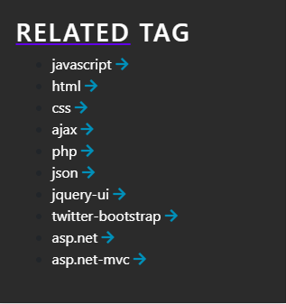
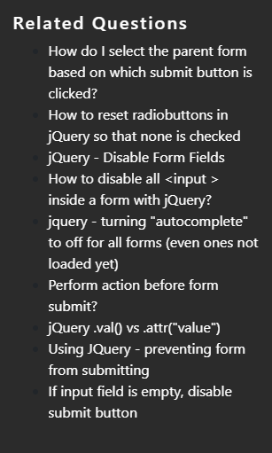

# How To optimize your results with Ask4Keywords

Here are some tips to optimize your result using the Ask4Keywords tool.

Ask4keywords is a combination of a keyword finder and a knowledgebase.

- Keyword finder: Use the keyword finder to learn the keywords most used concerning a particular topic or programming language. You can use that information to get insight into what interests developers.
- KnowledgeBase: It is a significant source of information on tons of IT-related topics. You can easily find a vast amount of information on any web programming topics. Whether it's for educational purposes, to solve an issue, or just out of curiosity, you can learn a lot with the thousands of inquiries available on Ask4knowledgeBase.
 
Here are some tips to optimize your result while searching on Ask4Keywords.com.Filter

Use the filter to fasten the process; it will speed up your search process, especially if you are looking for help on a precise subject. 

## Related tags

Use the related tag function to help you in your research.

 
## Related questions

Use the related questions function when you need to find retaliated inquiries to deepen your understanding of a specific subject.
 

 
## Additional Tools

If you want to explore further and expand your knowledge of web development, you can find additional learning tools such as:

- Riptutorial.com
- Ask4KnowledgeBase.com

## Expert/ Accepted answers

Prioritize expert and accepted answers. Although all answers can be useful, expert answers are written by well-known and highly rated Stachoverflow users. The accepted answers were highly voted up and accepted by the person who wrote the question. 

These answers tend to be more efficient, reliable, and more likely to be right.
